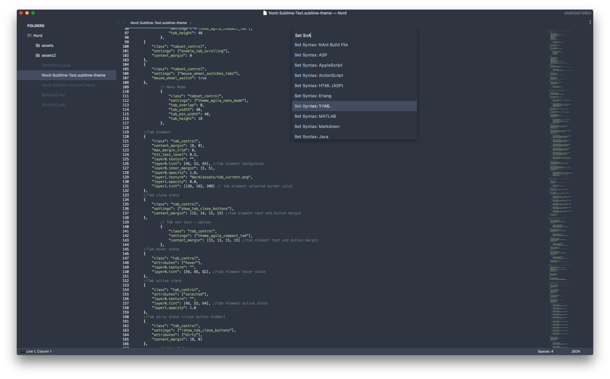

# SublimeNord

Unofficial [Nord](https://github.com/arcticicestudio/nord) Theme.

## Installing

Not a package. Simply save to the sublime packages folder and it *should* work. 

## Thanks To

- [Agila-Theme](https://github.com/arvi/Agila-Theme) - .sublime-theme source code and Icons (and the very helpful comments!)
- [Boxy](https://github.com/ihodev/sublime-boxy) - Icons
- [fjlaubscher](https://github.com/fjlaubscher/nord-sublime-text) - .tmTheme source code
- [carlevison](https://github.com/carlevison/Nord-Sublime-Text/blob/master/Material-Theme.sublime-theme)

## Suggestions

I'm not a designer nor a UI expert. If there are mistakes or things that I could do to improve the theme, simply add an issue. 